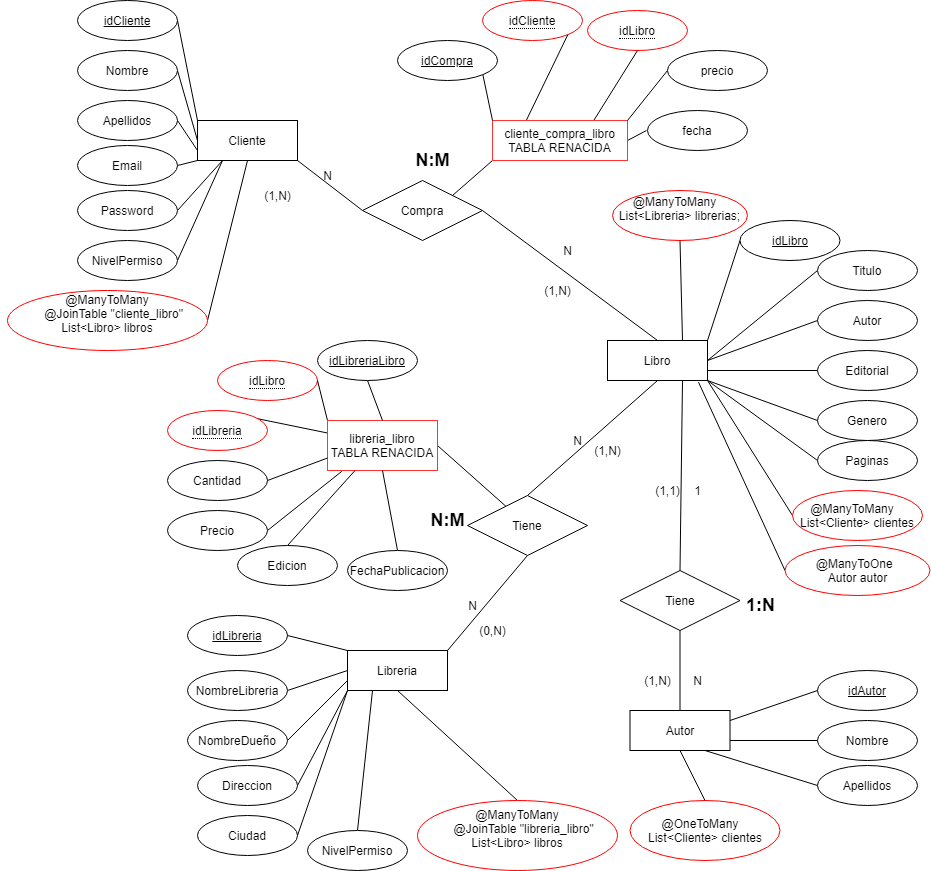
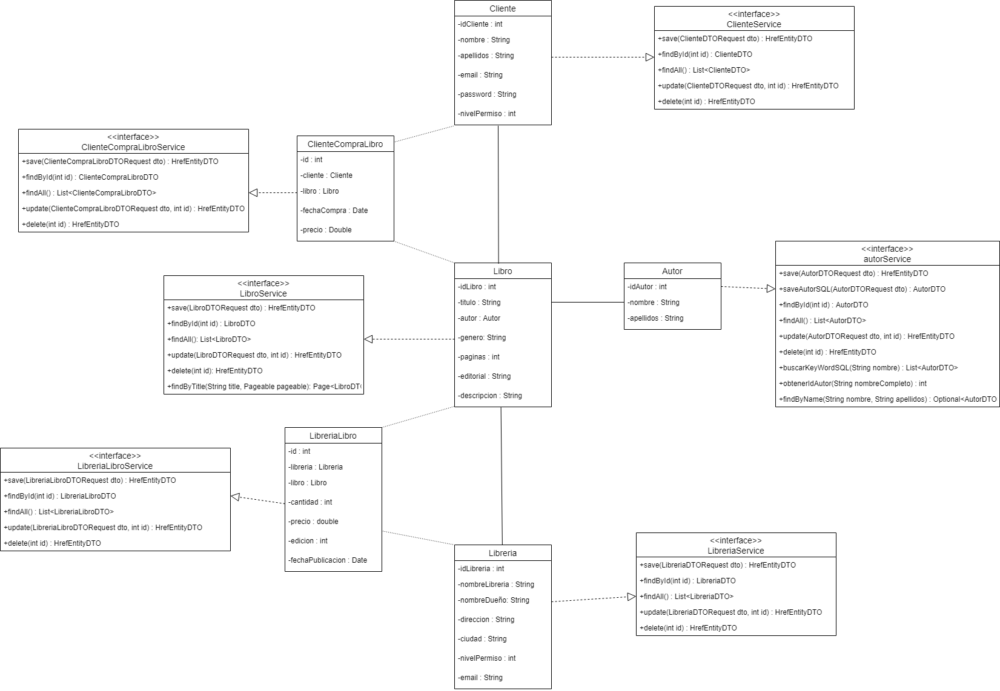
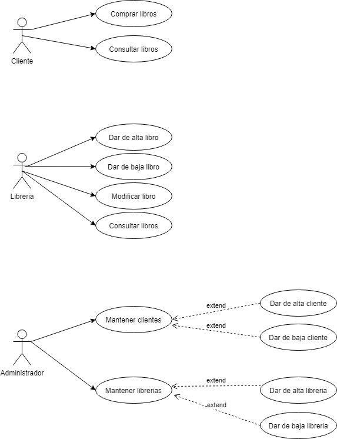

# Alten-Practicas
## Proyecto API REST Practicas Alten

Realizada por:

###  Alberto Arroyo Santofimia

## Objetivos: 
1. Preparar una idea de proyecto del tipo API REST en el que se consuman los servicios proporcionados por la API.
2. Crear un diseño de modelo de datos
3. Implementar el modelo de datos
4. Crear un proyecto back del tipo API Rest en SpringBoot
5. Diseñar los métodos y verbos del proyecto
6. Crear un proyecto front en Angular que muestre y consuma esos métodos de la API
7. Añadir diseño mediante Bootstrap a la parte front
8. Añadir seguridad al proyecto. Permisos de usuario, diferentes roles, etc.

## Práctica Alberto: 

La idea del proyecto es una pagina web de venta de libros de segunda mano. Libros
particulares o exclusivos. Donde los usuarios pueden poner a la venta sus librerias
y podran ver los libros que ponen a la venta otros usuarios.
Estamos en una epoca que el coleccionismo está cada vez mas cotizado y hay mucho mercado 
de libros de segunda mano, libros exclusivos, ediciones limitadas, etc.

A través de la web podran acceder 3 tipos de usuarios:

- Cliente: Podrá comprar y consultar los libros que están disponibles.
- Libreria: Podrá dar de alta, baja, modificar libros disponibles.
- Administrador: Podrá dar de baja usuarios cliente y libreria.

El modelo de datos consistira en que:

- El cliente puede comprar de 1 a muchos libros y el libro puede ser comprado por más de un cliente
- La libreria puede tener muchos libros y los libros a su vez pueden estar en más de una libreria

Inicialmente tendremos el siguiente diagrama entidad relacion:

Diagrama de clases

Diagrama de casos de uso

