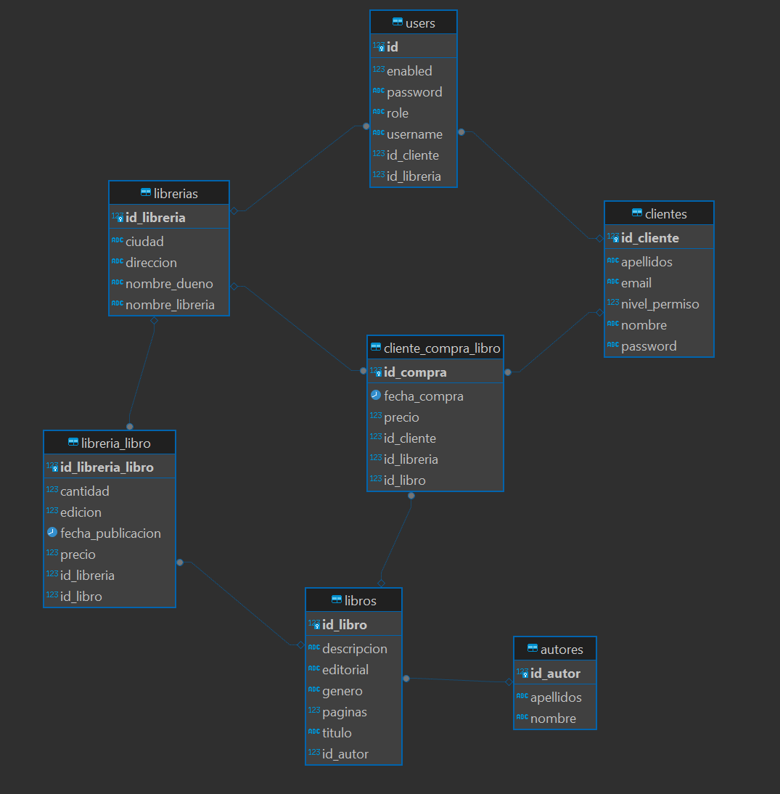

# Alten-Prácticas
## Proyecto API REST Spring boot + PostgreSQL + Angular + Encriptación

Realizada por:

###  Alberto Arroyo Santofimia

## Objetivos: 
1. Preparar una idea de proyecto del tipo API REST en el que se consuman los servicios proporcionados por la API.
2. Crear un diseño de modelo de datos
3. Implementar el modelo de datos
4. Crear un proyecto back del tipo API Rest en SpringBoot
5. Diseñar los métodos y verbos del proyecto
6. Crear un proyecto front en Angular que muestre y consuma esos métodos de la API
7. Añadir diseño mediante Bootstrap a la parte front
8. Añadir seguridad al proyecto. Permisos de usuario, diferentes roles, etc.

## Práctica Alberto: 

El proyecto consiste en desarrollar una página web de compra-venta de libros de segunda mano específica para un colegio. 
La plataforma permitirá a los padres y estudiantes vender y comprar libros que ya no utilizan, 
promoviendo así la reutilización y el ahorro en la adquisición de material educativo.

A través de la web podran acceder 2 tipos de usuarios:

- Usuarios: Podrá comprar y consultar los libros que están disponibles.
- Administrador: Podrá dar de alta/baja usuarios y consultar todos los usuarios.

El modelo de datos consistira en que:

- El cliente puede comprar de 1 a muchos libros y el libro puede ser comprado por más de un cliente
- La libreria puede tener muchos libros y los libros a su vez pueden estar en más de una libreria

Inicialmente tendremos el siguiente diagrama entidad relacion:

Diagrama E/R Tablas

Diagrama de clases

Spring boot

Angular

Añadido servicio para encriptación del proyecto. Cifrado y descifrado determinista utilizando el algoritmo AES, Base64.

